# PhotoShare

**A collaborative photo-sharing app built with Flutter and Supabase.**

  

PhotoShare lets you create groups, organize shared albums inside them, and control — per album, per photo, and per member — exactly who gets to see what. It's built with Flutter on top of Supabase (Postgres + Auth + Realtime) and Cloudinary for image hosting.

> **v0.0.1-alpha** — first public build. This is an early, personal-project-stage release: expect rough edges, and please read [Known Limitations](#known-limitations) before reporting something as a bug.
>
> This repository distributes a **pre-built Android APK only** — the app's source code is not published here.

---

## Table of Contents

- [Current Release Status](#current-release-status)
- [Main Features](#main-features)
- [Screenshots](#screenshots)
- [Technology Stack](#technology-stack)
- [Supabase Integration](#supabase-integration)
- [How the App Is Organized](#how-the-app-is-organized)
- [Download & Install the APK](#download--install-the-apk)
- [Build Information](#build-information)
- [Roadmap](#roadmap)
- [Known Limitations](#known-limitations)
- [Contributing](#contributing)
- [License](#license)
- [Credits](#credits)

---

## Current Release Status

| | |
|---|---|
| Version | `v0.0.1-alpha` |
| Platform | Android only |
| Distribution | Signed release APK, attached to the [GitHub Release](https://github.com/Pouria26/Photoshare/releases) |
| Source code | Not published in this repository — this is an APK-only distribution |
| Backend | Supabase (a shared backend operated by the developer; you don't need your own project to use the APK) |
| Stability | Alpha — core flows work end-to-end but are still being hardened |

---

## Main Features

- **Groups** — create private (invite-only) or public (discoverable, unlimited members) groups, each with a cover image and up to 5 topic tags.
- **Albums with per-member visibility** — inside a group, each album can be shared with a specific subset of members, so different people can see different albums in the same group.
- **Photo uploads with per-photo visibility** — when sharing a photo into a group album, you can further restrict which individual members can see that specific photo.
- **Explore** — discover public groups and browse trending public photos, sorted by recent activity ("Hot").
- **Friends** — search for users by username, send/accept/decline friend requests, and see mutual groups on their profile.
- **Group invitations & join requests** — invite friends directly to a group, or let people request to join a group that requires approval.
- **Notifications** — Receive notifications for likes, comments, group invitations, and other important activity. Notification features continue to be refined as the app evolves.
- **Profiles** — your own profile (stats, photo grid, edit profile, light/dark theme) and public profile pages for other members.
- **Light & dark themes.**

---

## Screenshots

### Home & Discovery

Your groups appear on the Home tab as soon as you sign in, and the Explore tab is where you find content you haven't joined yet — public groups on one tab, a trending grid of public photos on the other.

<table>
<tr>
<td width="33%">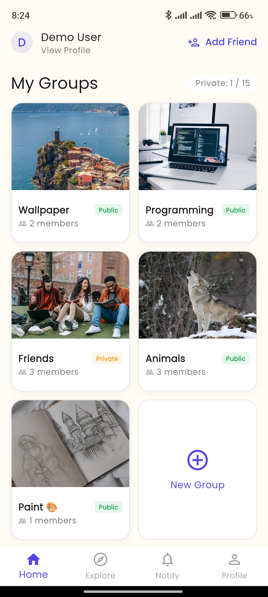</td>
<td width="33%">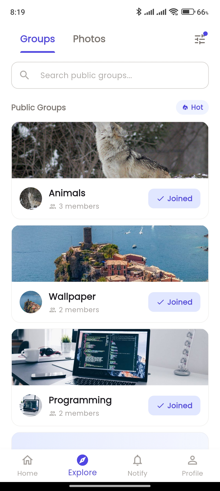</td>
<td width="33%">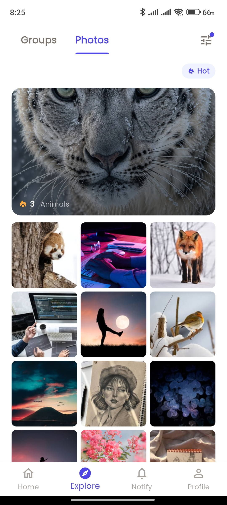</td>
</tr>
<tr>
<td valign="top"><b>Home.</b> All the groups you belong to, both public and private, with member counts and quick access to create a new one.</td>
<td valign="top"><b>Explore · Groups.</b> Public groups sorted by "Hot" activity, with a one-tap Join/Joined state and a search bar to look for a specific one.</td>
<td valign="top"><b>Explore · Photos.</b> A masonry grid of trending public photos pulled from across all public groups, so you can see what's active without joining first.</td>
</tr>
</table>

### Groups & Albums

Creating a group means choosing whether it's private or public and tagging it so it's discoverable; albums live inside a group and can be scoped to specific members.

<table>
<tr>
<td width="33%">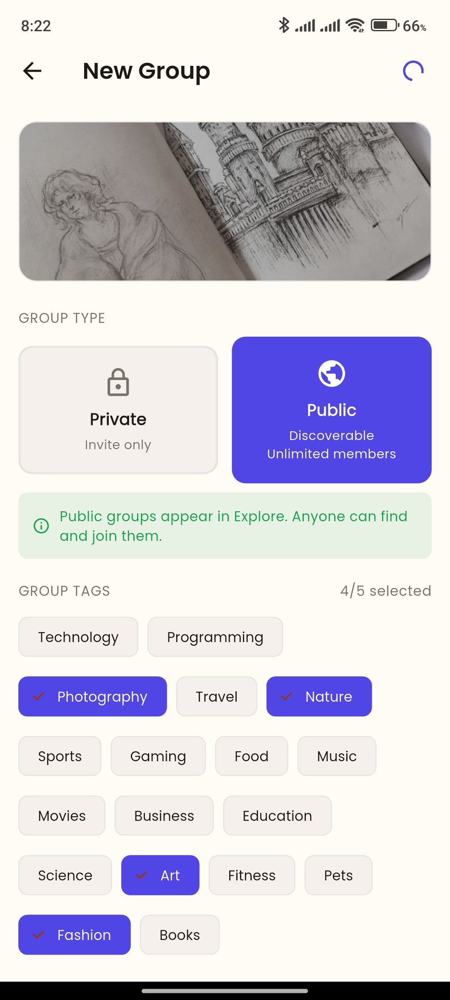</td>
<td width="33%">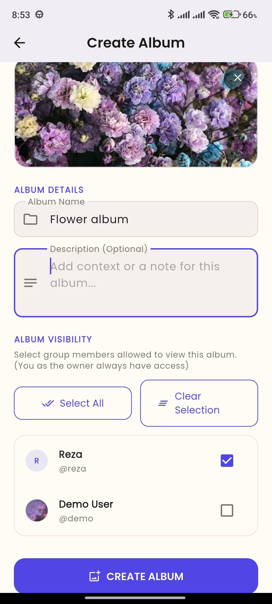</td>
<td width="33%">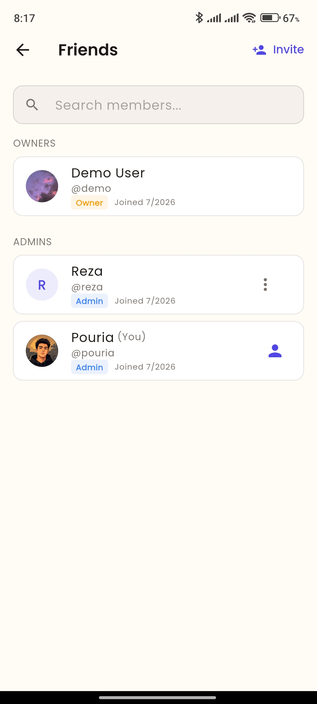</td>
</tr>
<tr>
<td valign="top"><b>New Group.</b> Pick Private (invite-only) or Public (discoverable, unlimited members), add a cover photo, and choose up to 5 tags to help people find it in Explore.</td>
<td valign="top"><b>New Album.</b> Name the album and choose exactly which group members are allowed to see it — the owner always has access regardless of selection.</td>
<td valign="top"><b>Members.</b> Owners and Admins are listed with their roles and join dates; Admins can manage other members directly from this screen.</td>
</tr>
</table>

**Per-member album visibility** is one of PhotoShare's core ideas: the same group can look different depending on who's viewing it. In the example below, two members of the same "Friends" group each see a different number of albums, because album access is granted per person rather than to the whole group at once.

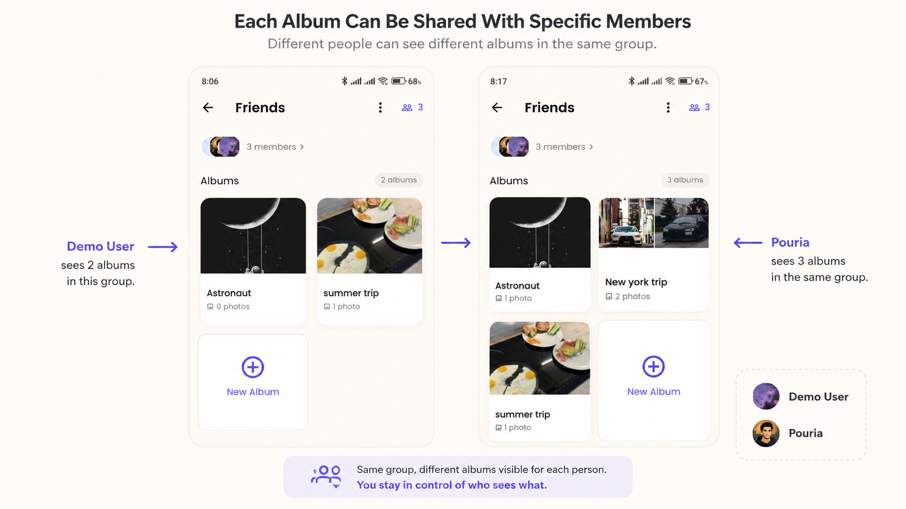

### Photos & Sharing

Uploading a photo lets you write a caption and, for private groups, fine-tune who besides the group's default audience can actually see it — a second layer of control on top of the album's own visibility.

<table>
<tr>
<td width="33%">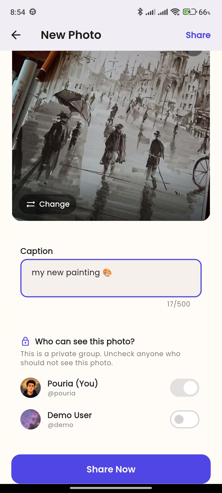</td>
<td width="33%">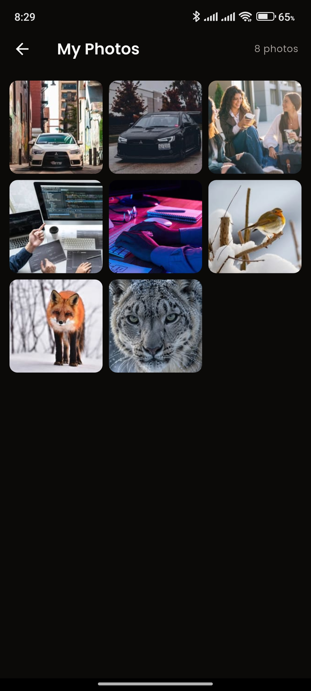</td>
<td width="33%">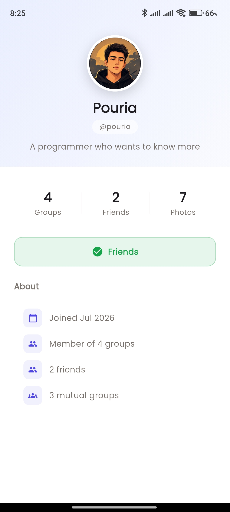</td>
</tr>
<tr>
<td valign="top"><b>Upload.</b> Pick a photo, add a caption, and — in a private group — toggle exactly which members can see this specific photo before sharing it.</td>
<td valign="top"><b>My Photos.</b> Every photo you've ever uploaded across all your groups, in one grid.</td>
<td valign="top"><b>Public Profile.</b> Viewing another member shows their stats, mutual groups, and friend status, without exposing anything they haven't made visible to you.</td>
</tr>
</table>

### Friends, Invitations & Notifications

Friend requests, group invites, and join requests all flow through the same in-app request/response pattern, and every relevant event shows up in Notifications.

<table>
<tr>
<td width="33%">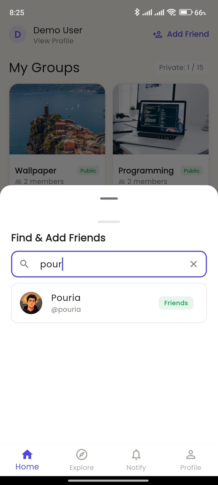</td>
<td width="33%">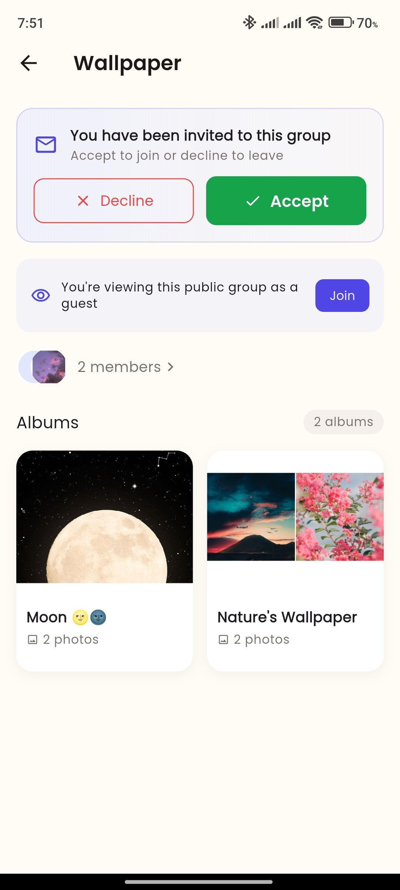</td>
<td width="33%">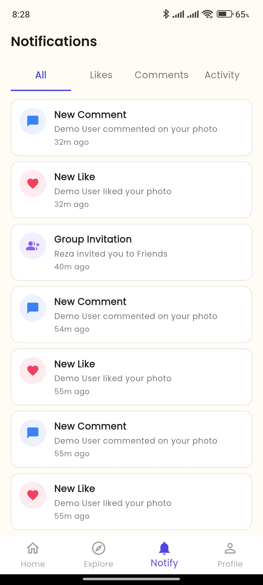</td>
</tr>
<tr>
<td valign="top"><b>Find Friends.</b> Search by username and send a friend request; existing friendships and pending requests are reflected right in the search results.</td>
<td valign="top"><b>Group Invite.</b> When someone invites you to a group, you can accept to join, decline, or — for public groups — browse it first as a guest before deciding.</td>
<td valign="top"><b>Notifications.</b> Likes, comments, and group invitations in one feed, filterable by type so activity notifications don't drown out the ones you actually asked for.</td>
</tr>
</table>

### Profile

The profile screen doubles as your settings hub, including the light/dark theme toggle.

<table>
<tr>
<td width="50%">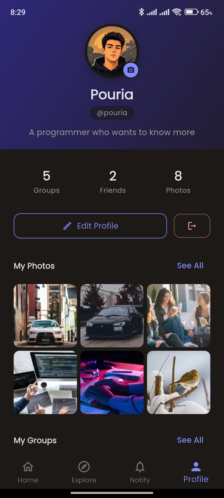</td>
<td width="50%">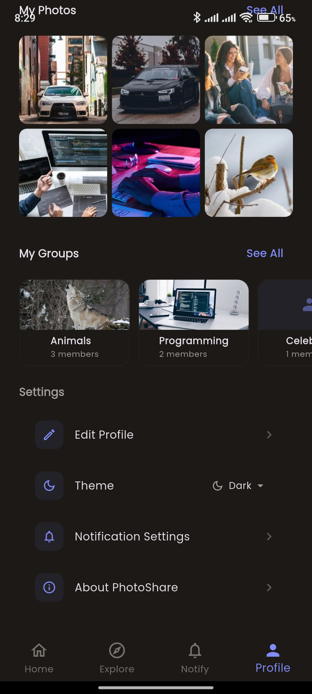</td>
</tr>
<tr>
<td valign="top"><b>Light theme.</b> Your stats (groups, friends, photos), an "Edit Profile" shortcut, and your recent photos and groups at a glance.</td>
<td valign="top"><b>Dark theme.</b> The same profile screen with the dark theme enabled, scrolled down to the Settings section (theme toggle, notification settings, about).</td>
</tr>
</table>

---

## Technology Stack

| Layer | Technology |
|---|---|
| Framework | Flutter (Dart ≥3.0, Flutter ≥3.10) |
| State management | Riverpod (`flutter_riverpod`) — hand-written providers. `riverpod_generator`/`build_runner` are present as dev dependencies but codegen is not currently used in the app |
| Routing | `go_router` |
| Backend | Supabase (PostgreSQL, Auth, Realtime) |
| Image hosting | Cloudinary, via direct HTTP calls (no Cloudinary SDK) |
| Local persistence | `flutter_secure_storage`, `shared_preferences`, `path_provider` |
| Image handling | `image_picker`, `flutter_image_compress`, `cached_network_image`, `photo_view` |
| Push notifications | `flutter_local_notifications`, `firebase_core`, `firebase_messaging` |
| Sharing | `share_plus` |
| UI | Material 3, `google_fonts` (Poppins), `flutter_svg` |
| Environment config | `flutter_dotenv` |
| App icon generation | `flutter_launcher_icons` (Android only — `ios: false`) |

## Supabase Integration

PhotoShare uses Supabase as its entire backend — there is no separate custom server:

- **Auth** — email/password sign-up and sign-in, with email confirmation and password-recovery deep links handled through a custom `photoshare://` URI scheme.
- **PostgreSQL** — groups, albums, photos, comments, likes, friendships, and notifications are all stored in Postgres tables, with Row Level Security policies enforcing who can read/write what (including the per-member album/photo visibility feature).
- **Realtime** — Postgres change subscriptions push live updates (new photos, comments, likes, membership changes) to open screens without polling.

The APK distributed in [Releases](https://github.com/Pouria26/Photoshare/releases) is built against a Supabase project and Cloudinary account operated by the developer — you don't need to set up your own backend to use it.

## How the App Is Organized

The app follows a feature-first Clean Architecture layout, with each feature (auth, groups, albums, photos, social, friends, notifications, explore, profile) split into `data` / `domain` / `presentation` layers, Riverpod providers for state, and `go_router` for navigation. See [`docs/architecture.md`](docs/architecture.md) for a full breakdown.

> Since this repository is APK-only, `docs/architecture.md` is a description of how the app is built, for anyone curious — it isn't a guide to building from source.

## Download and install apk

The latest Android version of **PhotoShare** is available from the project's GitHub Releases page.

**Latest Release:**
https://github.com/Pouria26/Photoshare/releases/latest

### Installation

1. Open the **Latest Release** page and download the latest APK from the **Assets** section.
2. If prompted, allow your browser or file manager to install apps from unknown sources.
3. Open the downloaded APK and complete the installation.
4. Launch **PhotoShare**, create an account or sign in, and start sharing your memories.

---

## Build Information

| Property                    | Value                                           |
| --------------------------- | ----------------------------------------------- |
| **Application**             | PhotoShare                                      |
| **Platform**                | Android                                         |
| **Current Version**         | v0.0.1-alpha                                    |
| **Version Code**            | 0.0.1+1                                         |
| **Minimum Android Version** | Android 7.0 (API 24) or later                   |
| **Release Type**            | Alpha                                           |

## Known Limitations

- **Android only** — no iOS, web, or desktop build is currently produced or supported.
- **Alpha quality** — this is a personal project in active development; expect bugs and rough edges.
- **Source code is not published** — this repository distributes the APK and documentation only.
- **Backend is shared, not self-hosted** — the app talks to a Supabase/Cloudinary backend operated by the developer; there's no option to point it at your own backend from this build.

## Contributing

The source code isn't public yet, so contributions here take the form of feedback rather than pull requests:

- **Found a bug?** Open an [Issue](https://github.com/Pouria26/Photoshare/issues) with what happened, what you expected, and your device/Android version.
- **Have an idea for a feature?** Open an Issue describing it — suggestions are genuinely welcome, even at this early stage.

See [CONTRIBUTING.md](CONTRIBUTING.md) for more detail.

## License

This project is licensed under the MIT License — see [LICENSE](LICENSE) for details.

## Credits

Built and maintained by [Pouria26](https://github.com/Pouria26).

Third-party services used: [Supabase](https://supabase.com), [Cloudinary](https://cloudinary.com), [Firebase Cloud Messaging](https://firebase.google.com/products/cloud-messaging).
